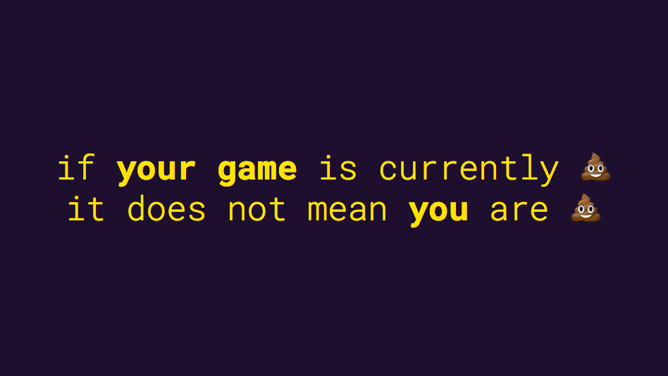

### Learning by making mistakes and by making games

<!-- During this unit you will undertake a **series of game development projects**. For each project, you **propose** a game that fits its specific brief and then **implement** it. Projects must be appropriate in scope, and pass an approval stage based on a project proposal submission and oral interview. Once projects are approved, you are expected to deliver the proposed game and document it fully. This **documentation** takes the form of images, video, commented source code, executables, websites, and written evaluation, following the method indicated in the project brief. -->

The first part of the unit will focus on **game design** basic concepts and techniques, which you will practice by making a **board game**. In the second part you will transfer the skills&ideas **from analog to digital** game making. You will create a **videogame** using [p5.play](http://p5play.molleindustria.org/).

Remember...

 

<!-- What this unit is NOT -->

# Plan

When | What | What?! | Home<del>work</del>play
---- | ---- | ------ | ----
Thursday  05.10 | [**Level 01**](levels/01)  Hacking games with *verbs* | Mechanics + dynamics + aesthetics (MDA) | Individual: pick a game of your choice and analyse its MDA  Individual: 10 bad boardgame ideas
Thursday  12.10 | [**Level 02**](levels/02)  Prototyping the Minimum Viable Game (MVG) | Game core, toy vs game, prototyping | Individual: solo playtest + writeup  Team: video-tutorial of your hack from Level 01
Thursday  19.10 | [**Level 03**](levels/03)  Playtesting | Game state, game play, rules+algorithms | Team: draft a rulebook for your game prototype
Thursday  26.10 | [**Level 04**](levels/04)  Blind playtesting | Feedback loops, choices & chance, types of fun | Team: prepare boardgame for submission
Thursday  02.11 | Level 05  From boardgames to videogames | Economies and balance, real-time vs turn-based, flowcharts | Individual: 10 bad videogame ideas
Thursday  16.11 | Level 06  Intro to p5.play | Preload, setup, draw, animation | Team: start prototyping your game on paper
Thursday  23.11 | Level 07  Autonomous behaviour | Mouse&keyboard controls, collision detection | Playtest your videogame
Thursday  30.11 | Level 08  TBD | Bookkeeping + scores, game over | Elevator saga?
Thursday  07.12 | Level 09  Tutorials | | Document your code
Thursday  14.12 | Level 10  Final boss | Presentations | Feedback from the players (students)

<!-- # Learning goals -->

<!-- # Rules of the road --> 

# Briefs

### Brief 01

**Prototype a *fundane* boardgame!**

This will be a **team project**.

Your boardgame prototype will be **inspired by everyday life**: take a *mundane* task (like washing the dishes) or an awkward social situation and turn it into a game! 

No monsters, swords, dungeons, spaceships or armies will be tolerated in your game.

Due date: **Thursday, the 2nd of November**

Submission checklist:

- [ ] Game prototype required
- [ ] Rulebook required
- [ ] VLE group submission required
- [ ] Videotutorial desirable

More details [here](levels/04/README.md#finalise-your-game-prototype-and-rulebook-team).

### Brief 02

**Make a videogame with p5.play!**

This will be a team project.

More details to follow.

# Suggested reading

* [Tabletop Game Design for Video Game Designers](https://www.goodreads.com/book/show/22477999-tabletop-game-design-for-video-game-designers) by Ethan Ham

### License

This work is licensed under a [Creative Commons Attribution-NonCommercial-ShareAlike 4.0 International License](http://creativecommons.org/licenses/by-nc-sa/4.0)

