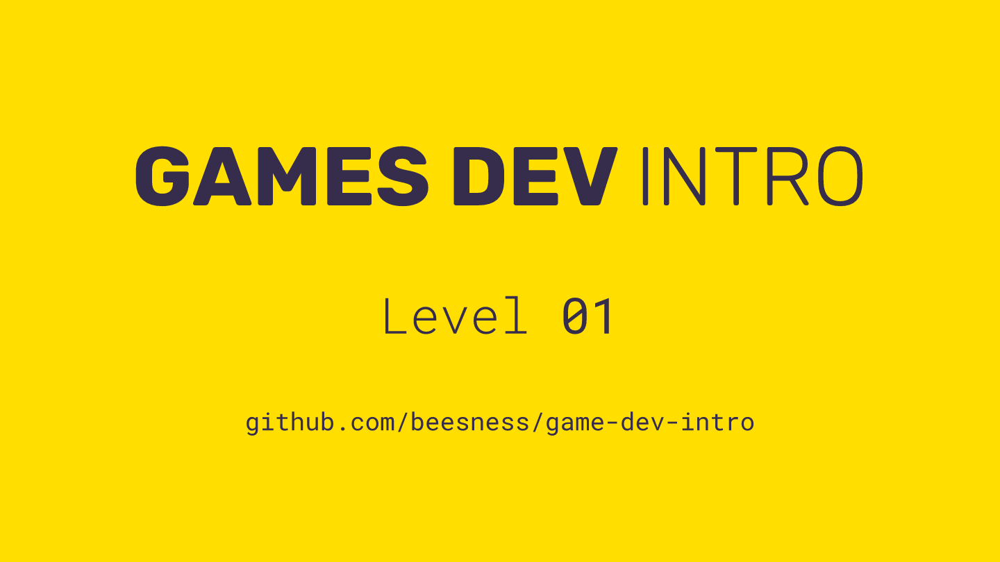

# Level 01

### Today, Thursday 5th October 2017

1. Intros and extros 
2. Gamified discussion: why *boardgames*? 
3. GameJam: hacking games with verbs! 

 

Click the image above to view the presentation + notes
 
## Your home<del>work</del>play!

### MDA

Individual: pick a game of your choice and analyse its MDA

### 10 bad ideas

Individual: 10 bad boardgame ideas with the Random Idea Generator (p.51-52)