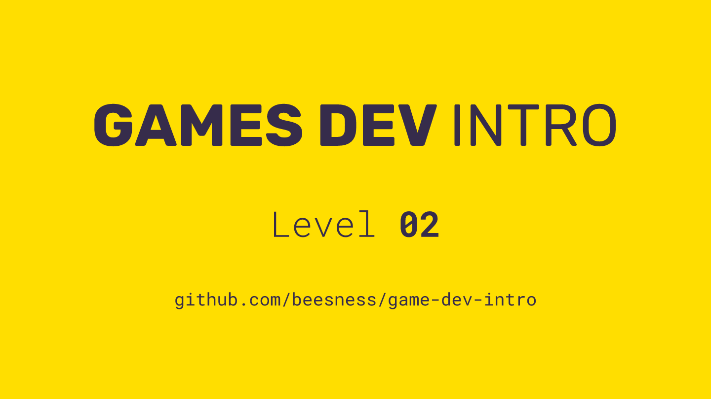

# Level 02

### Today, Thursday 12th October 2017

1. Gamified ideation: *Rank Ideas Battle*
2. Prototyping the Minimum Viable Game (MVG) 

 

Click the image above to reveal  **slides & notes** for today
 
## Your home<del>work</del>play!

### Solo-playtest your boardgame prototype and record your observations individual

*Solo-playtesting* means you play your game on your own, pretending that you are all players! 

It may feel awkward the first few times, as you take on the role of all the players and consequently decide on all their moves and know all the in-game information.

However, solo-playtesting is extremely useful to ensure your prototype doesn't have mechanical flaws (the equivalent of code bugs) and that emerging play dynamics are in line with what you expect. By testing your game *solo* you also avoid wasting other people's time.

I always solo-playtest new game concepts, and every time I introduce a change to an existing game.   

Take notes as you solo-playtest your prototype, and jot down ideas for improvements or fixes to the game. 

Then record your solo-playtest observations in writing, images, audio, video, or any combination of these formats. Publish your observations online (for example: on your blog, or on YouTube, or on SoundCloud ... *anywhere* as long as it's publicly accessible) and share the link with the rest of the class.

### Hacking games with verbs: document your hack team

[Last week](../01) you hacked a traditional board game from [10 Best Games in the World](https://www.goodreads.com/book/show/13127542-the-10-best-games-in-the-world) into something new.

Record a **video-tutorial of how to play your hack**. Publish it online (for example on YouTube ... or *elsewhere* as long as it's publicly accessible) and share the link with the rest of the class.