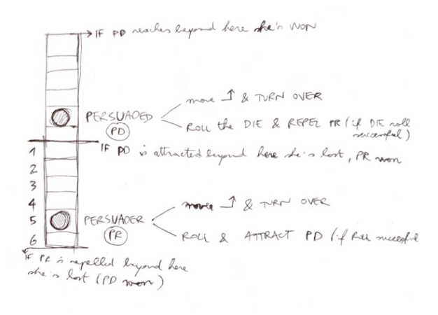

# Dicing dates

### A game about gambling your way in or out of a date with someone.

**2 players, 5-15 minutes.**

Heavily inspired by [Shoot Out](https://www.boardgamegeek.com/boardgame/23025/shoot-out) (Reiner Knizia).

### Core

- [ ] A 6-faced die
- [ ] Two tracks numbered 1 to 6, joined so that 6 on one track is next to 1 on the other
- [ ] Two pieces that represent the two players on the tracks

Decide if you want to play the *Charmer* trying to win over the other player, or the *Skeptic* trying to push the Charmer back.

Place your player piece at number 5 on your numbered track.

* Charmer wins if Skeptic is pulled over to Charmer's side (ie if Skeptic moves beyond 6 on their track). 
* Skeptic wins if they reach beyond 1 on their track, or if they push Charmer beyond 6 on Charmer's track.

Decide who will go first.

On your turn, you can either:

1. **Move down** one step on your track and end your turn.
2. **Roll the die**. If you roll a number equal to or smaller than the position you're currently on, then your turn is over. Otherwise, *move the other player's piece up one on their track*. After a successful roll, you also get an extra turn (and you can keep going until you either move or roll unsuccessfully).

### Full 

In the full version of *Dicing Dates* you play several games. 

#### Scoring

The first game is worth 1 point, the second 2 points etc. **The first player to reach 7 points wins!**

#### Dating budget

Just like in real life, you don't get infinite chances to charm / repel someone. So you each start with a *dating budget*:

* **6** text messages
* **3** face2face meetings

When you roll the die, you either spend 1 text message or 1 meeting. Meetings are more effective, so when you use them you can add **+1** to your die roll. 

### Reload

At the end of a game, the winning player receives 1 meeting and 2 text messages. The losing player receives 2 meetings, 3 texts, and the right to go first in the next game. 

