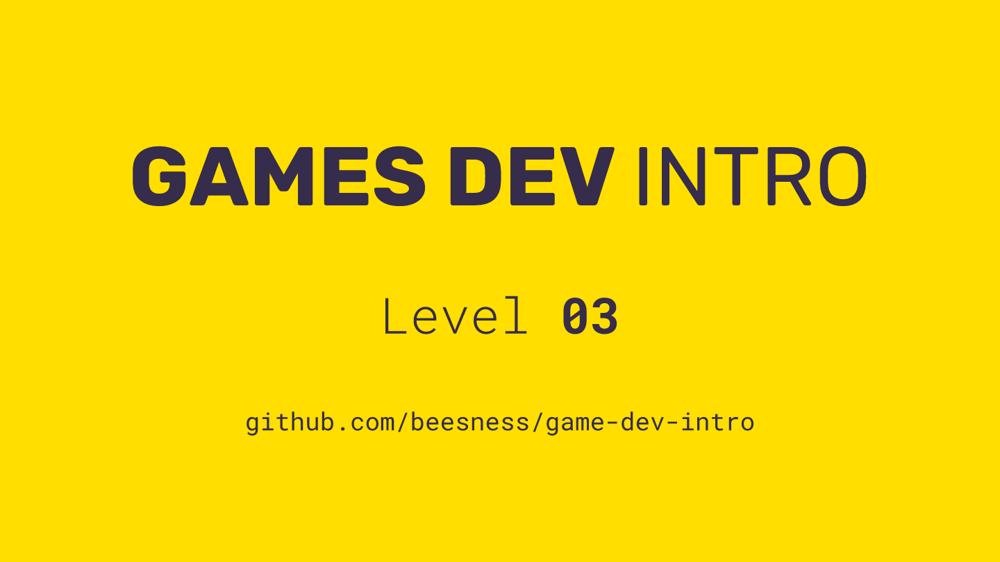

# Level 03

### Today, Thursday 19th October 2017

1. *Fundane*: hack your own game with everyday life
2. Playtesting your prototype 

 

Click the image above to reveal  **slides & notes** for today
 
## Your home<del>work</del>play!

### Draft a rulebook for your game prototype team

A rulebook is a **fundamental yet often neglected** part of a game. What's the point in designing something awesome if nobody can understand the rules well enough to play it?

When you explain the game to playtesters, pay attention to what they misunderstand, and to what they ask repeatedly while playing. Those clarifications will need to be in the rulebook!

Here's a **checklist** of what your rulebook may contain (feel free to experiment with this template):

1. **Introduction**: what is this game about and how do you win
2. Game **components** 
3. **Setup**: how to prepare the game
4. **Gameplay**: what happens each turn
5. End game: **win and defeat** conditions 
6. **Examples** of play

Draft your rulebook using [this template](https://docs.google.com/document/d/1koDwwuW0Lt66bZpQL-D84FCVdwFb42FYbhoAew2XRn0/edit?usp=sharing). 

Next week you'll need it for *blind playtesting*.

You can find useful advice on how to write rulebooks [here](http://ryanmacklin.com/2015/02/11-rules-board-game-writing/) and [here](http://numberless.net/blog/2007/04/09/how-to-write-rules-without-confusing-people/).

[Here](https://github.com/beesness/game/tree/master/versions/v10) is the rulebook for my game Beesness (work-in-progress). What do you think?
