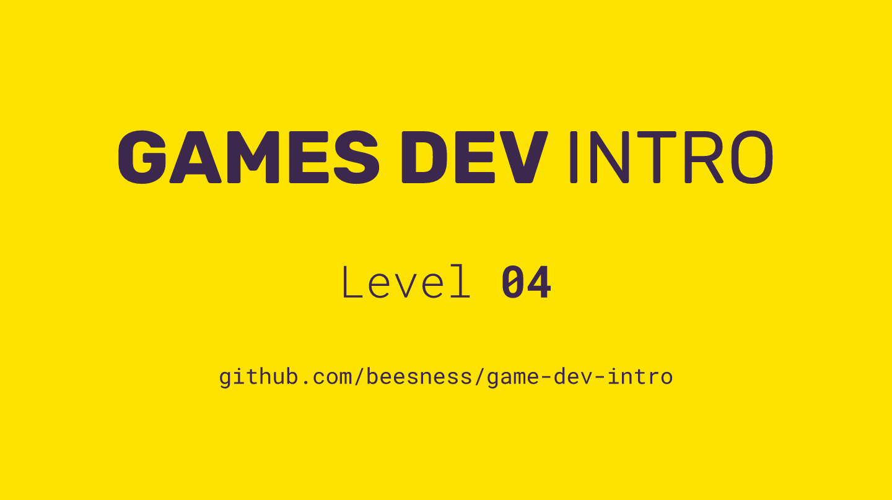

# Level 04

### Today, Thursday 26th October 2017

1. Feedback loops
2. Playtesting
3. Choices and chance
4. Blind playtesting
5. Types of fun

 

Click the image above to reveal  **slides & notes** for today

## Your home<del>work</del>play!

### Finalise your game prototype and rulebook team

Checklist for your submission, **due on Thursday, 2nd of November**:

- [ ] **Game prototype** required

	Your game prototype must include **all the components** required to play it. Board, cards, dice etc.
	
	They don't have to look good. Scribbled boards and cards are perfectly fine. Make sure that they're legible though.
	
	Put all your game components in a box or a sealable bag.

- [ ] **Rulebook** required

	Your rulebook must be available online as a **Google Doc**. Include a link (ideally a short-link) to the rulebook in your game box/bag. 
	
	Even better, print out the rulebook and drop it in your game box/bag. 
	
	Your rulebook should have a **mix of images and text**. For instance, including a **flowchart** of the core mechanics is a pretty smart idea.
	
	Here's a comprehensive [list of what topics your rulebook should cover](../03/README.md#draft-a-rulebook-for-your-game-prototype-team).

- [ ] **Videotutorial** desirable
	
	To score extra points, record a videotutorial on how to play your game, and drop the link in your game box/bag.

### PlaytestUK your game team

Join the [PlaytestUK guild on meetup.com](https://www.meetup.com/Playtest/).

There's a [meetup on **Friday 27/10**](https://www.meetup.com/Playtest/events/243645528/) and [another on **Wednesday 01/11**](https://www.meetup.com/Playtest/events/243930497/) which you should attend. Both at the Southbank Centre.

Even if you don't get to attend those and playtest your game, these meetup are a super-useful way to meet friendly fellow designers, and learn how they bring ideas to life and test them with people. Plus, you get to play new, yet-to-be-published games!