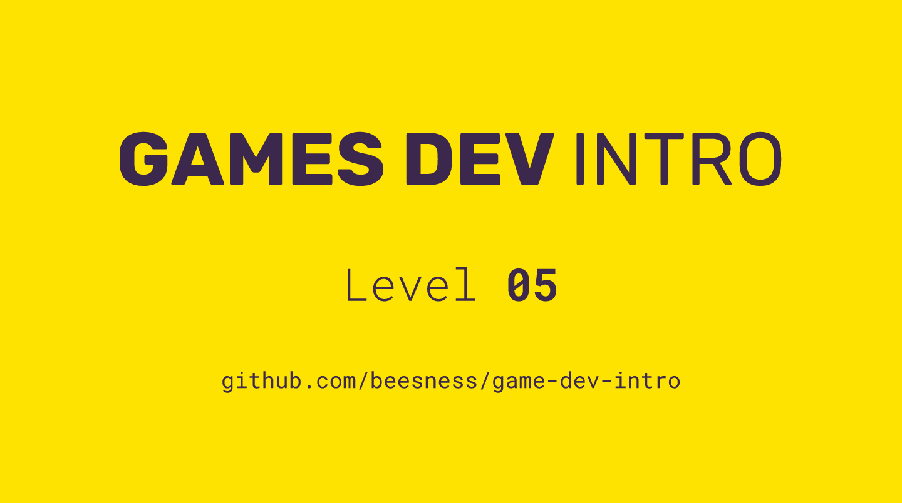

# Level 05

### Today, Thursday 2nd November 2017

*Remember remember*. You need to **hand in your boardgame**, both as a physical object and as an [online submission on the VLE](https://learn.gold.ac.uk/mod/assign/view.php?id=494284) before midnight today!

1. Types of fun
2. Economies 
3. Balance
4. Scoping your next game

 

Click the image above to reveal  **slides & notes** for today

## Your home<del>work</del>play!

### 10 original game ideas individual

Write/sketch 10 ideas for your [brief 02 videogame](../../README.md#brief-0w). 

* *Original* means: no descriptions of existing games
* *Game* means: not just story plots or scenarios
* *Idea* means: don’t think about whether you are able to develop it *but* if it’s something you would be interested in developing

Some [inspirations](http://ludumdare.com/compo/ludumdare/)

<!-- Adapted from http://mycours.es/gamedesign2016/assignments/too-many-ideas -->

Some [ideas to generate ideas](https://gamedesignconcepts.wordpress.com/2009/07/09/level-4-the-early-stages-of-the-design-process/). 

<!--

---------

# Notes to self

from https://vimeo.com/86738382

> Hacking accounting machines into expressive machines

> problem-making rather than problem-solving

> criticality

> embracing, celebrating dysfuctional system

from https://vimeo.com/206651691

> new ideas require new forms, it's not just about putting a new, maybe political or critical face, on top of an existing game system

> _the mechanic is the message_

> scoping: establishing the boundaries (of your game, of your argument)

> what's the rhetorical scope, ie the argument you want to make, the message you want to convey through your game?

> go very abstract, or go very specific

possible brief could be to make Pong, and then break Pong, eg: http://www.kongregate.com/games/pixelate/understanding-games-episode-1

LimPong http://www.gamesforchange.org/play/lim

More arty games here https://gamedesignconcepts.wordpress.com/2009/07/16/level-6-games-and-art/

From https://gamedesignconcepts.wordpress.com/2009/07/06/level-3-formal-elements-of-games/

**There are many ways to critically analyse a game, but I offer a three-step process**

1. Describe the game’s formal elements. Do not interpret at this point, simply state what is there.
2. Describe the results of the formal elements when put in motion. How do the different elements interact? What is the play of the game like? Is it effective?
3. Try to understand why the designer chose those elements and not others. Why this particular player structure, and why that set of resources? What would have happened if the designer had chosen differently?

Some questions to ask yourself during a critical analysis at various stages:

* What challenges do the players face? What actions can players take to overcome those challenges?
* How do players affect each other?
* Is the game perceived by the players as fair? (Note that it may or may not actually be fair. Perception and reality often differ.)
* Is the game replayable? Are there multiple paths to victory, varied start positions, or optional rules that cause the experience to be different each time?
* What is the game’s intended audience? Is the game appropriate for that audience?
* What is the “core” of the game — the one thing you do over and over that represents the main “fun” part?

-->