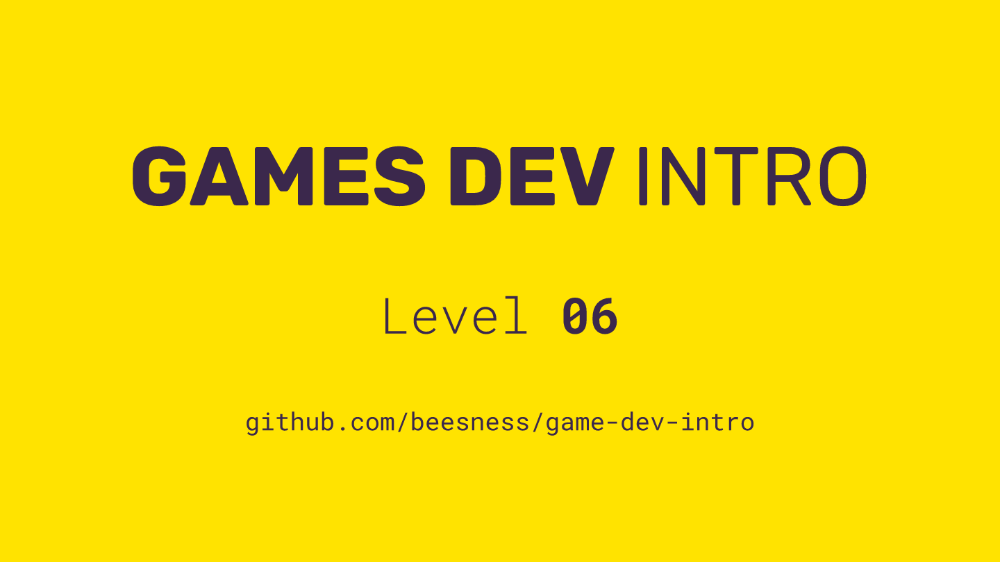

# Level 06

### Today, Thursday 16th November 2017

1. Boardgames: what did we learn?
2. From boardgames to videogames: **time**
3. Get to know [**p5.play**](http://p5play.molleindustria.org/)
4. **Scoping** your next game

 

Click the image above to reveal  **slides & notes** for today

## Your home<del>work</del>play!

### Build the toy individual

The **toy in a game** is usually its core mechanic(s), without ways to win/lose and problems to solve.

Using [**p5.play**](http://p5play.molleindustria.org/), build something that is *interactive* and potentially *enjoyable*, based on one of your videogame ideas.

You can download [this **emoji-pong** zip](https://github.com/beesness/emoji-pong/archive/c184eb79adf2f08a2ed3b9506437e7e9e4fc34a9.zip) as a *hackable template* for your toy.