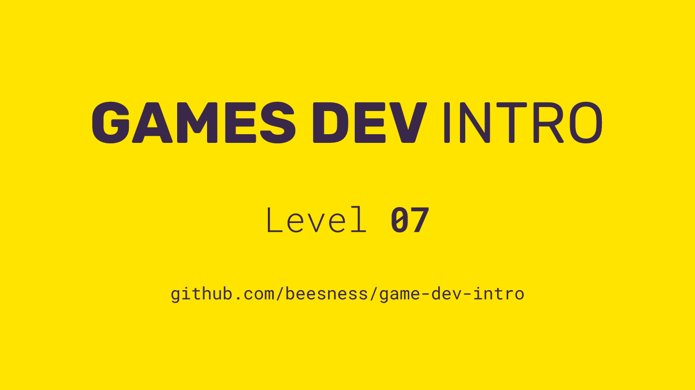
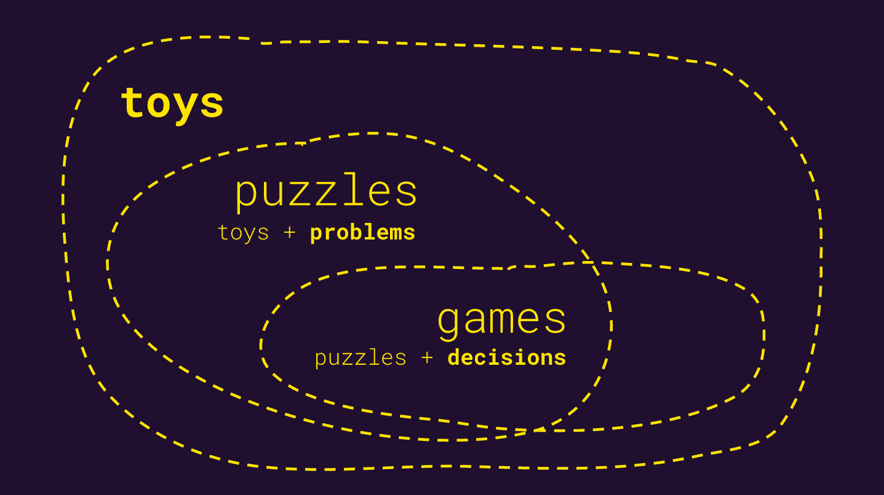

# Level 07

### Today, Thursday 23rd November 2017

1. Algorithms: from flowcharts to code
2. Meaningful gameplay: from paper to interface
3. Workshop: working with spritesheets

 

Click the image above to reveal  **slides & notes** for today

## Your home<del>work</del>play!

### Build the puzzle individual

A _puzzle_ can be many things, and this word may particularly confuse you in the context of games and make you think of a specific genre, *puzzle games* (such as [Tetris](https://en.wikipedia.org/wiki/Tetris) or [Angry Birds](https://en.wikipedia.org/wiki/Angry_Birds)). So let's be clear. What I mean by *puzzle* here is any **interactive system that presents problems to solve to its users**.

Over the last week you should have worked on the *toy* within your videogame, ie its core mechanic(s), without ways to win/lose or problems to solve.

Building on that, experiment with  [**p5.play**](http://p5play.molleindustria.org/) and add one or more problems for players to solve. These could be enemies to defeat, obstacles to overcome, riddles to untangle, labyrinths to escape from, missions to achieve...

At this stage your game should also start taking shape visually, through emojis.

<!--
You can download [this **emoji-pong** zip](https://github.com/beesness/emoji-pong/archive/c184eb79adf2f08a2ed3b9506437e7e9e4fc34a9.zip) as a *hackable template* for your toy.
-->