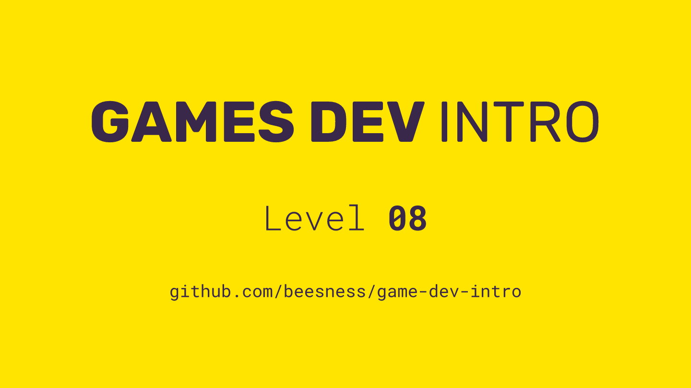

# Level 08

### Today, Thursday 30th November 2017

1. *Meaningful gameplay* from paper to interface
2. Publish your draft game to [itch.io](https://itch.io/) 
3. Playtest
4. Workshop: working with *spritesheets*
5. Workshop: keeping scores

 

Click the image above to reveal  **slides & notes** for today

## Your home<del>work</del>play!

### Research inspiring games on itch.io individual

What does *inspiring* mean?

Games that catch your attention because of their theme / controls / visual style / gameplay / interface.

On [itch](https://itch.io/) **search** for games that are `Playable in browser` and possibly `local multiplayer` so that they are similar to the game you are building. 

Then **list at least 3** games you found inspiring in [this spreadsheet](http://bit.ly/vg-sheet).

Bonus: explain why they inspire you.

### Prepare your game for playtest individual

What changes are you going to make to your game after today's playtest?

Next week we'll have a final round of playtesting in class, before the presentations on Thursday the 14th. 

Bonus: playtest your game with friends/family (you can share the link to `YOUR_USERNAME.itch.io/YOUR_GAME` with them).