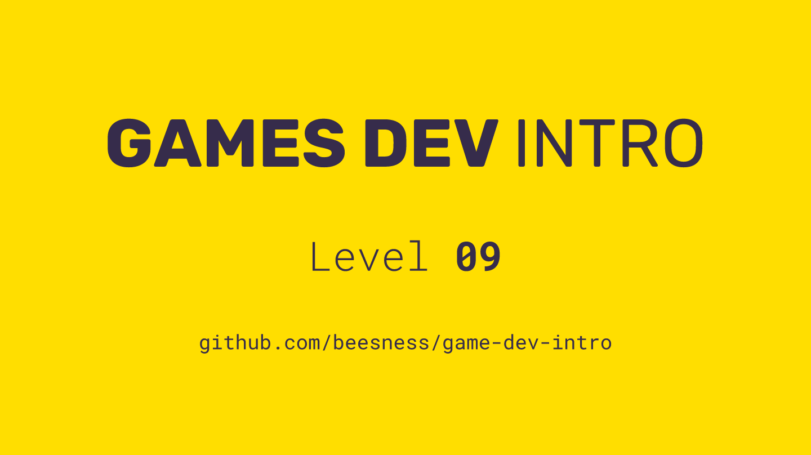

# Level 09

### Today, Thursday 7th December 2017

1. Upload your interface sketches to [bit.ly/emoji-sketches](http://bit.ly/emoji-sketches)
2. Publish your game to [itch.io](https://itch.io/) 
3. Playtesting + tutorials

 

Click the image above to reveal  **slides & notes** for today

## Your home<del>work</del>play!

### Finalise your videogame individual

Checklist for your submission, **due on Thursday, 14th of December**:

- [ ] Your **videogame** must be playable by at least 3 players, visualised exclusively through emojis AND published on `itch`.
	
- [ ] A **zip folder** with all your game code and assets (the same zip you've uploaded to `itch`.
	
- [ ] Your videogame **interface sketches**.

- [ ] A **list of games** from `itch` that inspire you. 	  

- [ ] **VLE submission** 
 
	Coursework must be submitted via the VLE (learn.gold) so that we can officially grade it. 
	
	 All you need to do is visit [this page](https://learn.gold.ac.uk/mod/assign/view.php?id=504029). Upload a zip folder and make sure it includes links to your videogame `itch` page, code+assets, interface sketches, and anything else you believe could improve your mark.